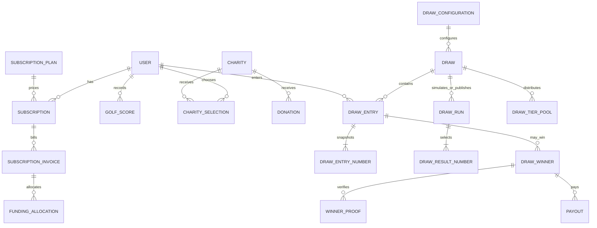

# Digital Heroes Database Design

Status: approved initial schema decisions; the overall contribution percentage remains an explicit per-configuration operations setting because the PRD does not specify a default.

Source: `DigitalHeroesPRD.pdf`, edition 2026. PostgreSQL is the relational source of truth. Supabase Auth is not used; Django owns account identity and authorization, while Supabase provides PostgreSQL and object storage.

## Design rules

- Use UUID primary keys for business records and UTC timestamps for event times.
- Store money as integer minor units plus an ISO currency code. Never use floating-point values for money.
- Keep provider identifiers, webhook processing, score history snapshots, draw runs, reviews, and payout state explicit so operations can be retried and audited.
- Use database constraints for row-level invariants. Use atomic Django services and row locks for rules spanning multiple rows.
- Do not store payment-card data. Stripe remains the payment system of record.

## Entities

### Accounts and billing

| Table | Important fields and constraints |
| --- | --- |
| `auth_user` + `accounts_userprofile` | Keep Django's existing user model because its initial migrations are already applied to Supabase. Add a one-to-one profile for product-specific fields. Anonymous visitors are not stored. Effective `PUBLIC`, `SUBSCRIBER`, and `ADMIN` access is resolved from authentication, active subscription, and admin status rather than trusting a client-supplied role. |
| `subscription_plans` | Stable code (`monthly` or `yearly`), amount in minor units, currency, Stripe Price ID, active flag. Stripe Price IDs are unique. |
| `subscriptions` | User and plan FKs, unique Stripe Subscription ID, lifecycle status, current period bounds, cancel-at-period-end and cancellation timestamps. Preserve historical subscription rows; derive access from current status and period. Index `(user_id, status, current_period_end)`. |
| `subscription_invoices` | Unique Stripe Invoice ID, subscription FK, amount/currency, paid status and paid timestamp. Store no card details. |
| `stripe_webhook_events` | Unique Stripe Event ID, event type, received/processed timestamps and processing status. The unique provider ID makes webhook handling idempotent; retain only the payload data needed for support. |

### Scores and charities

| Table | Important fields and constraints |
| --- | --- |
| `golf_scores` | User FK, score date, Stableford score, created/updated timestamps. Check `1 <= score <= 45`; unique `(user_id, score_date)`; index `(user_id, score_date DESC)`. A score update edits the existing row for that date. |
| `charities` | Unique slug, name, description, image object path, website, active/featured flags, display order and timestamps. Directory changes do not require deployment. |
| `charity_events` | Charity FK, title, description, start/end times, location and optional image object path. |
| `charity_selections` | User and charity FKs, contribution percentage in basis points, effective start/end. Check 1,000 to 10,000 basis points; allow only one current selection per user with a PostgreSQL partial unique constraint where `effective_to IS NULL`. Keep prior selections for allocation audit. |
| `donations` | Independent optional donation, user and charity FKs, amount/currency, unique Stripe Checkout Session and PaymentIntent IDs, status and timestamps. Independent donations are not tied to draw eligibility or subscription allocation. Checkout and final payment state are recorded from server-side Stripe calls and signed webhooks. |

The latest-five score rule cannot be enforced by a simple row constraint. Score writes must lock the user row, insert/update the dated score, then remove rows older than the newest five in the same transaction. A new backdated score outside the retained window is rejected rather than accepted and immediately discarded. Draw entries must snapshot the exact scores/numbers used so later score edits or rolling retention do not change historical results.

### Draws and prize accounting

| Table | Important fields and constraints |
| --- | --- |
| `draw_configurations` | Versioned rules: draw mode (`random`/`algorithmic`), number-selection parameters, and explicitly selected prize contribution percentage. Simulations snapshot the configuration used. Publication enforces the PRD tier shares (5-match 4,000 bps, 4-match 3,500 bps, 3-match 2,500 bps). |
| `draws` | Configuration FK and immutable config snapshot, scheduled time/window, eligibility cutoff, status (`draft`, `simulated`, `published`, `cancelled`), created/published timestamps. Each draw has its own schedule so multiple draws in one month remain possible. |
| `draw_runs` | Draw FK, run type (`simulation`/`publish`), algorithm version, input snapshot/hash, result snapshot, generated timestamp and audit metadata. Simulation runs never publish results or create payable winners. |
| `draw_entries` | Unique `(draw_id, user_id)`, eligibility/subscription snapshot and source score snapshot. A published draw's entries are immutable. |
| `draw_entry_numbers` | Entry FK, ordinal, number and optional source score FK. Unique `(entry_id, ordinal)`. Add uniqueness for `(entry_id, number)` only after confirming duplicate picked numbers are forbidden. |
| `draw_result_numbers` | Draw/run FK, ordinal and winning number; unique `(run_id, ordinal)`. Only the published run is authoritative. |
| `draw_tier_pools` | Unique `(draw_id, match_count)`, configured share, available amount, rollover-in amount, rollover-out amount and currency. Shares and actual amounts are both snapshotted. |
| `funding_allocations` | Source invoice FK, optional draw and charity-selection FKs, allocation type (`prize_pool`, `charity`, `platform`), amount/currency and unique idempotency key. Paid invoices create the selected charity allocation for the billing-period selection; draw publication separately records prize allocations and prevents the configured prize share plus the charity share from exceeding the invoice amount. |
| `draw_winners` | Draw-entry FK, tier/match count, gross prize amount/currency, verification state and timestamps. Unique `(draw_entry_id, match_count)`. Multiple winners in a tier receive an equal share calculated from that tier pool. |

Unclaimed five-match funds roll forward as an explicit amount into the next draw published in schedule order. Four- and three-match leftovers do not roll forward per the PRD. Annual invoices contribute one-twelfth of their amount per monthly draw; the contribution calculation rounds down in minor units. A draw cannot settle multiple currencies, and a carried jackpot cannot change currency. Prize calculations must be deterministic and safe to retry; publish/funding changes use database transactions and unique idempotency keys.

### Verification, payout, and administration

| Table | Important fields and constraints |
| --- | --- |
| `winner_proofs` | Winner FK, Supabase Storage bucket/object path, submitted timestamp, review state, reviewer user FK, review timestamp and reason. Store object paths, not public file URLs. Multiple submissions can preserve rejected proof history. |
| `payouts` | Winner FK, amount/currency, status (`pending`, `paid`, `failed`), unique external payout reference, paid timestamp and timestamps. A winner cannot be marked paid until approved. |
| `admin_audit_events` | Admin user FK, action, target type/UUID, timestamp, request/correlation ID and minimal before/after metadata. Avoid copying secrets or unnecessary personal data. |

## Relationship map

## Transaction and indexing requirements

- Score create/update/delete: lock the user row, enforce one score per date, retain five newest scores atomically.
- Draw publication: lock the draw and relevant tier pools; record one authoritative run; snapshot entries/results; calculate each tier; split evenly; record rollover; mark published atomically. Retries must not duplicate winners or allocations.
- Webhooks: insert the Stripe event ID before processing; duplicate event IDs return the prior processing result.
- Index foreign keys and operational filters: subscription status/period, score user/date, draw status/schedule, entry draw/user, winner status, charity active/featured, and payout status.
- Admin list APIs use pagination; avoid unbounded result queries.

## Approved initial defaults

- A draw entry snapshots the subscriber's five latest Stableford scores, each in the inclusive range 1-45.
- Eligibility is evaluated against a fixed draw cutoff; the subscription must be active and paid at that cutoff.
- Annual subscription revenue is allocated across monthly draw periods; each period snapshots the charity selection that applies to it.
- The subscription contribution to the prize pool is set explicitly per configuration. No default percentage is assumed because the PRD does not specify one.

## Decisions still open

The PRD does not specify these details. Confirm them rather than baking assumptions into database constraints:

1. **Draw number rules:** Must entries and results contain five distinct numbers? How does random mode create an entry from the five submitted scores, and how exactly should score-frequency weighting work in algorithmic mode?
2. **Prize-pool funding:** Operations must choose a contribution percentage for each configuration. The current settlement assigns the entire configured contribution to the three PRD tiers, distributes rounding minor units deterministically, and blocks mixed-currency draws; confirm those policies before live monetary use.
3. **Charity accounting:** Is the minimum 10% based on the gross subscription price before discounts/tax? How are refunds and failed/partial payments reconciled?
4. **Jackpot rollover:** The current implementation carries the five-match pool forward until it is won and rejects a currency change while funds are carried. Confirm this policy if multiple plan currencies are introduced.
5. **Winner payment:** Which payout method/provider is required, and can an approved claim be split across multiple payout attempts?
6. **Admin boundary:** Is there one admin role, or do staff need distinct permissions for draw publication, charity editing, verification, and payouts?

## Implementation status

- Django models and additive migrations are implemented across the listed domains and applied to Supabase.
- Score writes use an atomic service with a per-user row lock and retain only the five most recent dates.
- Keep financial allocations and published draw snapshots immutable; use service-layer transactions for cross-row rules.
- Prize publication is transactional: it locks the draw, derives funding from active paid subscribers at cutoff, records idempotent invoice allocations, snapshots the published result, creates equal-share winner/payout records, and advances the 5-match rollover.